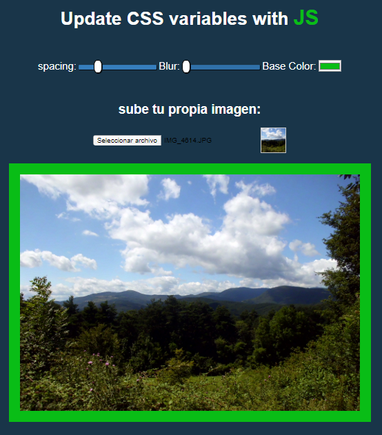

# reto-js-3-peresonaliza-imagenes

Nuevo reto de JS, en este reto tenemos el **objetivo** de poder modificar en una foto su marco en tamaño y color y también la nitidez de la foto usando **JS** y **css**.

Se utilizarán inputs de tipo range para poder graduar el marco y la nitidez, input tipo color, para poder cambiar el color del mismo.

Hemos utilizado un query.SelectorAll para todos los imputs y luego con un forEach le hemos pasado un evento, para reflejarlo en la web.
Con CSS he aprendido a definir variables ligadas al documento HTML con el pseudoselector :root, y poder añadir estas variables a la imagen.

# Nueva funcionalidad

Para que la web sea más interactiva he añadido un botón tipo field, para que el usuario pueda añadir su propia foto, y jugar con la decoración con sus propias fotos, y no sólo con la que viene por defecto!!

# Resultado

https://adharamonzon.github.io/reto-3-js-peresonaliza-imagenes/
